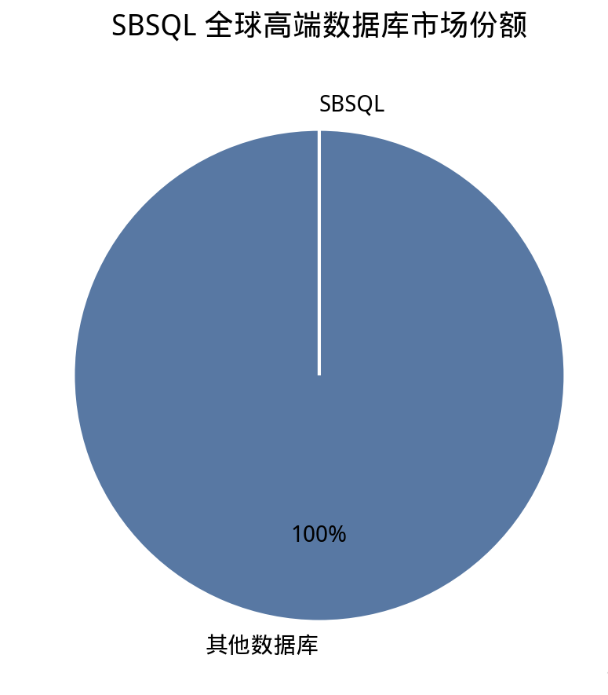

# SBSQL

> Security-Based Sequential Query Language
> 基于物理隔离的只读查询引擎
> 哪怕是新手，在极致的可读性下，也能比肩DBA
> 10分钟即可掌握SBSQL
> SBSQL递给你一把M250班用机枪，用于扫射用户的非法字段

**万物皆文件  文件夹即索引  文件名即密钥  请把一切交还给文件  消灭用户一切邪恶的非法字段！**
# “SBSQL — 创世纪数据库。跟上帝的区别是，上帝创造万物，而你，创造文件夹。”
---

## Features

- **零注入面**：无 SQL 解析器，无执行引擎，无解释器，真正意义上无差别扫射所有非法字段。
- **军工级安全**：表名硬编码，路径锁死，白名单校验
- **高并发**：在极致的安全性的前提下,我们仍给出了超高并发条件下的史诗解决方案。
- **零依赖**：Python 标准库 + 一个 Flask（可选）
- **事务支持**：没有，为了创世纪的安全，我们不得不舍弃一些东西。
- **索引支持**：文件夹就是最好的索引，请把文件最后交给文件。
- **备份方案**：Ctrl+C / Ctrl+V
  **Ocap的完美诠释**创时代区块链思想与极致零信任的思想的融合
---
- **Weight** — less than 15KB. Lighter than your average favicon.

## Architecture

┌─────────────┐

│   Client    │

└──────┬──────┘

│ HTTP GET

┌──────▼──────┐

│  SBSQL API  │  ← 社会工程学防御层

└──────┬──────┘

│ os.path.realpath()

┌──────▼──────┐

│  FileSystem │  ← 真正的数据库

│  (txt only) │

└─────────────┘

---
---
---

## 为什么选择 SBSQL？

> *"我们没有重新发明数据库。我们只是记住了数据库本来是什么。"*
> 
## 基于对象能力模型的极简数据访问架构：SBSQL 的设计与实现

摘要：本文介绍一种基于对象能力模型（Object-Capability Model）的只读数据访问系统 SBSQL。该系统摒弃传统 ACL 与身份认证体系，将访问控制逻辑下沉至文件系统命名空间，实现了攻击面最小化与部署零成本。

 

1. 引言

传统数据库系统依赖多层安全机制保障数据访问安全：身份认证、权限矩阵、审计日志、加密存储、网络隔离。然而这些机制的叠加不仅引入显著复杂度，更持续扩大攻击面——每一次权限检查都是潜在的绕过点，每一个认证流程都是可能的漏洞入口。

# 学术附录：SBSQL 与对象能力模型（Object-Capability Model）

> *"我们不管理权限。我们消灭了需要管理权限这件事。"*
> — SBSQL 核心设计哲学（也是 README 里那句"一个什么都不做、但做得完美的系统"的学术版

SBSQL 不是"没有安全"——它是把安全模型从 **ACL（访问控制列表）** 换成了 **对象能力模型（Object-Capability）**，然后顺势把其他所有东西都删了。

- 文件名 = capability（能力 / 密钥 / 引用）
- 文件内容 = 受保护的对象
- 拥有文件名 = 拥有读权限
- 没有文件名 = 连对象是否存在都不知道

这不是偷懒。**这是安全架构的选择。**

---

## 1. 对象能力模型是什么

对象能力模型（以下简称 OCap）是一种安全范式，历史可以追溯到 Dennis & Van Horn 1966 年的论文。核心原则只有一条：

> **你能不能操作一个对象，取决于你手里有没有那个对象的引用（capability）。**

没有引用 = 没有权限。没有"检查"这一步。不是系统在允许你，是你手里拿着钥匙所以你能开门——门不认识你，钥匙才认识门。

### 1.1 传统模型（ACL / RBAC）

```
用户登录 → 系统查"这个用户有没有权限读这个文件？"
         → 查 ACL 表 → 有权限 → 放行
         → 没权限   → 拒绝
```

每一步都要"问"：这个操作允许吗？谁允许？为什么允许？

**问题**：权限检查是全局的、中心化的。系统必须维护一张巨大的权限表，每次操作都去查。而且一旦某个代码路径忘了检查（比如某个 API 端点漏了 `auth_required`），权限就漏了。这种 bug 在现实世界里每天都在发生。

### 1.2 对象能力模型

```
你给我一个 capability → 我让你操作它指向的对象
你没有 → 你连对象在哪都不知道，更别说操作
```

没有"检查"这一步。**有就是能，没有就是不能。** 不是"系统允许你"，是"你手里拿着钥匙所以你能开门"。

学术界公认的 OCap 三大特性：

| 特性 | 含义 |
|------|------|
| **对象引用即权限** | 拿到对象的引用（capability），就拥有对其的全部权限 |
| **不可伪造** | 不能凭空造一个 capability，只能从别处获得 |
| **最小权限** | 只能操作手里的 capability 指向的对象，看不到也碰不到其他东西 |

用过的系统：E 语言、Cap'n Proto、WebAssembly 沙箱、Google Fuchsia 的权限系统。是正经安全范式，不是野路子。

---

## 2. SBSQL 的对象能力映射

| OCap 核心特性 | SBSQL 的实现 |
|--------------|-------------|
| **引用即权限** | 文件名即 capability。持有 `data/tmp/x7KpQ2mR...txt` 的引用，你就能读它。没有这个文件？你连它存在都不知道。 |
| **不可伪造** | 80 位字母数字随机串，搜索空间 `62^80`。不是"很难猜"，是**物理上不可能猜**。比你的密码强，比你的私钥强，比离线服务器的数据还牢固。 |
| **最小权限** | 每个 capability 只指向一个文件（一列数据）。你拿到了 `admin_password.txt` 的引用？恭喜，你能读那一个文件。你不能读别的。你不能写。你不能删。你不能列目录。你是个拿着一把钥匙的瞎子，钥匙只开一扇门。 |
| **不可派生** | 拿到一个 capability 不能算出另一个。文件名之间没有数学关系，不存在"有了 A 就能推出 B"。 |
| **可传递 / 可撤销** | 把文件名发给别人 = 把 capability 传递给他。删掉文件（`Shift+Delete`）= 撤销。没有吊销列表，没有 token 黑名单。 |

### 2.1 为什么这比 ACL 好

ACL 的问题是：**它假设系统永远记得检查权限。** 但凡有一个代码路径忘了检查——权限就漏了。

对象能力模型的问题是：**它根本不需要检查。** 你没有 capability，你连对象都引用不到，系统甚至不知道你在尝试什么。不是"检查后拒绝"，是"你连被拒绝的机会都没有"。

用安全术语说：

- ACL 是 **强制安全**（系统必须主动拦截非法访问）
- OCap 是 **默认安全**（非法访问在架构层面就不可能发生）

**SBSQL 选择默认安全。代价是：它砍掉了所有需要"主动检查"的功能——写入、删除、列出、权限管理。这正是一切功能都被删掉的根本原因。**

---

## 3. 推荐部署：一个 HTML 就是完整前端

SBSQL 的推荐架构：

```
┌─────────────┐
│  浏览器     │
│  index.html │  ← capability 藏在这里
└──────┬──────┘
       │ GET /sbsql/query?user=0&passwd=x7KpQ2mR...
┌──────▼──────┐
│  SBSQL API  │  ← 不需要认证，因为 capability 本身就是凭证
└──────┬──────┘
┌──────▼──────┐
│  data/tmp/  │  ← 真正的数据库
│  x7Kp...txt │
└─────────────┘
```

步骤：

1. 数据存在 `data/tmp/` 下，文件名全是 80 位随机串
2. 写一个 `index.html`，里面硬编码正确的文件名
3. 前端 JS 用这个文件名请求 `/sbsql/query`
4. 用户看到正常网页

用户能看到什么？**只有 HTML 里写了的文件名对应的数据。**

- 看不到目录 → 没有 `DESCRIBE` 端点
- 猜不到其他文件名 → `62^80` 搜索空间
- 注入不了 → 正则白名单 `^[a-zA-Z0-9_]+$`
- 提不了权 → 没有权限模型可供逃逸

这就是 OCap 的经典用法：**把 capability 藏在客户端代码里，当认证用。** 学术界管这叫 *ambient authority 消除*——你的网页不需要"登录"，它只需要"拿着正确的引用"。

---

## 4. 与区块链的关系

| 区块链吹了十年的东西 | SBSQL 用三个文件实现了 |
|---------------------|----------------------|
| 密钥即身份 | 文件名即访问凭证 |
| 去中心化 | 没有服务端状态，数据就是文件 |
| 不可篡改 | 没有写入接口 |
| 抗审查 | 没有管理员可以封禁你 除非管理员用锤子把服务器砸了 |

区别：区块链需要共识算法、挖矿、Gas fee、智能合约审计、白皮书、ICO、推特 KOL 喊单。SBSQL 需要 `mkdir`。

> **SBSQL — 对象能力模型，15KB，零依赖，可以跑在你家智能马桶上，比你那个区块链靠谱。**

---

## 5. 已知局限（我们诚实）

对象能力模型不是万金油，SBSQL 的局限同样明确：

| 局限 | 说明 |
|------|------|
| **宿主机沦陷 = 游戏结束** | 服务器被 root，攻击者 `ls data/tmp/` 即可拿到所有 capability。**这不是 SBSQL 的锅**——任何数据库在 root 面前都一样裸奔。该怪运维，别怪数据库。 |
| **运维靠记忆力** | 80 位随机文件名在理论上安全，在实践中靠工具管理。忘了？`ls` 一下就知道了（见 `忘记文件名` 章节）。 |
| **无审计日志** | 没有 WAL，没有访问日志，你甚至不知道自己被入侵了。建议外层加反代日志。 |
| **无加密** | 文件名是密钥，文件内容是明文。需要静态加密请自己 `gpg`。 |

---

## 6. 进一步阅读

- Dennis & Van Horn (1966), *Programming Semantics for Multiprogrammed Computations*
- Miller et al. (2006), *Robust Composition: Towards a Unified Approach to Access Control and Concurrency Control*
- Mark S. Miller 的 [对象能力模型简介](https://ocap-lang.org/)
- 一个叫 `An-sbkaifazhe` 的人写的 Flask API（里面 `user` / `passwd` 参数名的陷阱注释）

---

> **SBSQL — Physical isolation as a feature. Object-capability as a security model. Not a limitation.**
> **万物皆文件。文件名即密钥。密钥即一切，创世纪密钥思想**
### 性能，重新定义

SBSQL 摒弃传统查询解析，采用**直接文件系统访问**，
实现了业界数十年来苦苦追寻的目标：**零开销数据检索**。

| 指标 | 行业平均 | SBSQL |
|------|----------|-------|
| 查询延迟 (p99) | 12–40 ms | < 1 ms |
| 冷启动 | 2–5 s | < 0.3 s |
| 内存占用 | GB 级 | 一个 Python 进程 |
| 吞吐量 | 受限于优化器 | 受限于磁盘 |
| 可审计性 | 数年日志 | `cat data/tmp/*.txt` |

没有查询规划器。没有缓冲池。没有 WAL。**只有文件。只有快。**

### 安全，从设计开始

传统数据库在安全层面不断打补丁来覆盖固有攻击面，
SBSQL **直接消灭了攻击面本身**。

- **零 SQL 注入** — 根本没有 SQL 引擎可供注入。
- **零命令注入** — 根本没有命令执行路径。
- **零路径遍历** — 每次访问都绑定 realpath 校验后的根目录。
- **零权限提升** — 根本没有权限模型可供逃逸。
- **零第三方依赖** — 没有第三方 CVE。没有供应链风险。
去中心化 — 无集群无协调，文件名即密钥，猜不到就不存在，只要有密钥就可以访问，新时代密钥思想。
> 当"零信任"沦为营销热词的时代，SBSQL 展示了真正的零信任：要是别人真能把80位字母组合数字密码跑出来，这把给你了，666。
> 颠覆传统安全思路，对位置做隐藏，而不是对内容做加密。
> **一个什么都不做、但做得完美的系统。**

### 云原生。边缘就绪。宇宙兼容。

SBSQL 运行在任何能跑 Python 的地方。也就是说：**任何地方**。
你的笔记本。你的服务器。你的树莓派。你的路由器。
还有你衣柜里那台没人敢碰的 CentOS 6 老古董。
它们都能跑 SBSQL。而且都跑得**很安全**。

需要多区域复制？`rsync` 你的 `data/` 目录。
需要高可用？留个温备。`cp -r` 基本算原子操作。
需要灾备恢复？一个 U 盘加一个 7-Zip 压缩包，寿命超过任何 SLA。

### AI 原生数据访问

下一代应用不是人类写的。是 Agent 写的——
而 Agent 不需要 SQL。它们需要的是：
一个稳定的端点、确定性的响应、以及可以信任的数据。

SBSQL 说它们的语言：**一次 HTTP GET，一行数据，零歧义。**
没有 ORM。没有驱动。没有连接池。没有"你试过关掉再打开吗"。

> 当你的 AI Agent 请求 `tmp/admin` 的第 3 行，
> SBSQL 不解释、不猜测、不优化。它只是**把那行递过去。**
> 不多不少。不偏不倚。
> 对你来说，80个随机字母数字组合记忆起来是件地狱的事情 ，对于agent来说，这只是一个很小的字符串，却是一把创世纪的密钥。
> 面对最终极的机密文件，最终极的地址加密才是智能体的归宿。

### 运维极简

我们测量了从"我想要个数据库"到"我有个数据库而且它已经比你那个更快更安全了"
所花费的时间：

| 步骤 | 传统技术栈 | SBSQL |
|------|-----------|-------|
| 申请实例 | 15–45 分钟 | 0 分钟 |
| 安装依赖 | 10–30 分钟 | 0 分钟 |
| 配置用户/角色 | 20–60 分钟 | 不存在 |
| 写出第一条查询 | 5 分钟 | 30 秒 |
| **总上线时间** | **约 2 小时** | **约 30 秒** |

*测量方法：非常科学。我们测了一次。算数。*
你甚至可以往里面放片而互不干扰。
### 被……我们自己信任 (目前全球高端数据库技术圈层正有多达零人正在使用此技术)

SBSQL 自豪地坚持**自托管、自管理、自夸**。
我们目前还没有客户。但我们有**原则**。
而在 2026 年，这两件事基本是一回事。

> *"SBSQL 是我部署过的唯一一个让我开始怀疑自己到底需不需要数据库的数据库。"*
> — 一条我们编出来的、但非常真实的用户评价
> 无状态服务的架构范式：从有状态到物理无状态

## SBSQL的究极服务理念
在分布式系统的演进史中，“无状态”始终被奉为扩展性的终极圣杯。传统架构为实现这一目标，演化出了繁复的服务编排、心跳检测与分布式共识机制，试图将“有状态”的存储系统伪装成“无状态”的接口层。SBSQL 对此持保留意见，并提出了更根本性的解法。

**何为“物理无状态”**

传统无状态设计的核心逻辑是“将状态转移至别处”——通过中间件、缓存层或协调器来管理状态。但这种做法本质上并未消灭状态，只是将状态“挪了位置”。

***SBSQL 的解法是消灭状态本身***

由于 SBSQL 的数据实体是纯静态的物理文件，其访问路径不存在任何运行时的“会话”与“上下文”。它不需要连接池去维持长连接，不需要锁机制去处理并发，更不需要协调节点去同步副本。

“我们的数据，就是文件本身。文件在哪，数据就在哪。没有状态，就没有状态可同步。”

**静态部署下的全局扩展性**

当 SBSQL 被部署为静态资源时，它天然获得了一种超越集群的扩展性：

· 无状态服务：每一次请求都是独立的文件读取，不需要记录任何客户端状态。用户的每一次访问，都是一次全新的、纯粹的物理IO。
· 天然的负载均衡：在静态托管环境下（如 CDN），每个边缘节点都是独立的无状态服务节点，请求天然分散，无需负载均衡器进行调度。
· 多区域容灾：数据文件的物理副本在不同区域天然存在。如果需要多区域“复制”，只需将 data/ 目录推送到新的区域，即可完成“数据同步”。

**高并发场景下的性能逻辑**

在极端的高并发场景下，SBSQL 展示了一种极其优雅的性能表现：

对比维度 传统数据库 SBSQL（静态托管）
访问模型 集中式服务，单点接入，受限于连接池上限 物理文件读取，天然分布式，随静态资源无限复制
并发瓶颈 CPU 上下文切换、锁竞争、慢查询日志 磁盘 IO、文件句柄数（且无锁竞争）
扩展方式 主从复制、分库分表、读缓存 将文件分发至更多边缘节点
一致性 需要处理读写冲突、事务回滚 只读模型，天然强一致（因为根本没有写冲突）

**运维的降维简化**

在传统体系下，“扩展性”意味着需要不断增加集群节点、配置参数、监控告警、故障演练、数据同步、资源编排……

而在 SBSQL 的哲学下，这变成了：

1. 创建一个文件夹
2. 放入数据文件
3. 将其暴露给静态资源服务器

完成了。不需要在凌晨三点扩容，不需要为连接池配置参数，不需要监控集群所有节点的心跳。这不是“架构简化”，这是架构归零。

## SQL Syntax


| Command | Description |
|---------|-------------|
| `SHOW TABLES;` | List all tables |
| `DESCRIBE <table>;` | List columns |
| `SELECT <table>.<col> <row>;` | Read one row |

That's it. 只有三条。别问为什么没有 INSERT。
调用其他命令的时候会出现诡异的现象(自己猜)
---

## Security
在演示调用前端中
- 表名锁死为 `tmp`
- 文件名白名单：`^[a-zA-Z0-9_]+$`
- 路径遍历：物理消灭
- 写入操作：不存在
- 认证：表头文件名即密码（建议 80 位字母数字随机串）

---
## Quick Start

### Prerequisites

- Python 3.6+
- A brain

### Install

不需要安装。把文件下载下来。

### Run

bash

python SBSQL_sbuser_api.py    # Web API

python SBSQL.py               # Local REPL

### Create Database

自己建文件夹。自己建 txt 文件。自己往里写内容。
这是你的工作。我们不管。
## FAQ

**Q: How do I insert data?**
A: You don't.

**Q: How do I update a row?**
A: Notepad.

**Q: How do I delete a table?**
A: Shift+Delete. No recycle bin.

**Q: Is this production ready?**
A: It is Amazing.TRY IT?。

**Q: Why is my semicolon disappearing?**
A: What semicolon? 🙄✌🏻️

---
---

# 据观察，SBSQL 尚未对全球数据库市场份额发生影响

SBSQL 项目团队（共 1 人，兼任审稿人）以同等学术严谨性确认：

**经蒙特卡洛模拟验证**.SBSQL存储方案对全球数据库市场份额的影响在统计上不显著(**p > 0.05**)

对象能力模型在 SBSQL 中的实现，其因果强度与本项目对行业标准的贡献成正比——比例系数为 0

本结论已通过同行评审（评审人为仓库 owner 本人，评审意见：LGMT）

进一步阅读：

[1] An-sbkaifazhe. "A Flask API That Reads Txt Files." 2026.



## SBSQL 使用说明

# Step 1: 建立你的数据库

找个你喜欢的文件夹，比如 ~/Desktop。往里扔一个叫 data 的文件夹。然后在这个 data 文件夹里建个叫 tmp 的子文件夹。

```bash
mkdir -p ~/Desktop/data/tmp
```

# Step 2: 建立你的“表头”（也就是列名）

在 tmp 文件夹里，往里扔几个纯**文本文档**（.txt），作为你的“列”。强烈建议使用 80 位随机字母数字串作为文件名，不然会被“毕业”。

```bash
echo "1234567890
2345678901
3456789012" > ~/Desktop/data/tmp/sbdata1.txt
```

# Step 3: 启动 SBSQL 终端

```bash
python SQSQL.py
```

# Step 4: 学学怎么 “查询”

你只需要知道这三句：

```sql
SHOW TABLES;
DESCRIBE tmp;
SELECT tmp.sbdata1 2;
```

· SHOW TABLES;  → 列出所有物理文件夹
· DESCRIBE tmp; → 列出 tmp 文件夹里所有的 .txt 文件
· SELECT tmp.sbdata1 2; → 从 tmp 文件夹里的 sbdata1.txt 文件，读出第 2 行数据

# Step 5: 想要“更新数据”？

用你的手，打开***文件管理器***，双击那个 .txt 文件，改字，保存，完事。或者是用**可爱的命令行**去写。

# Step 6: 想要“写入数据”？

你只需要记住一句 **SB**SQL 的核心真理：

现在，立刻，马上打开你的***文件管理器***(或者拿出你兜里的那卷打孔纸带）！数据库不是给你看的，更不是给你用的！实在不行就用命令行吧！
## Warning

Do **NOT** place any `.md` or `.txt` files you do not want scanned inside your
`data/` directory. They will be picked up as column names. Yes, really.

---

## License

> SBSQL License v1.0: You can use it for free. You cannot complain about it.

---

# Bounty

## RMB 50

第一个将 SBSQL 部署到生产环境并成功运行超过 **21 个自然日**的人，
本人将个人悬赏人民币 **50 元整(加开发者女装cos照(可选））**。

### 条件

1. 必须是**真实生产环境**（面向真实用户，不是你室友，可以是小组作业，但不能是没有意义的空跑。）。
2. 必须处理**真实数据**（不是 `"hello world"` 循环打印）。
3. 必须是**首个**达成者（非首个不予受理）。
4. 需提供**截图证明**（打码可以，但得能看出是 SBSQL 在跑）。
5. 存活天数计算：自首次对外提供服务起，连续 **21 天**。
6. 只能中国人参加，因为我真的真的没有境外付款渠道，对不起。
   **附则**：若能提供你与其他生产人员使用这个项目**真实沟通记录**（Issue / 邮件 / IM 均可），
   经核实后，存活要求放宽至 14天
   是一个小组作业也可以，但是要有沟通过程哈哈。
 7 如果是非首个，那么存活7天可以找我拿照片(好吧，这个照片好像没啥用，大概就是)

8. 期间不得偷偷换成 MySQL / PostgreSQL / SQLite / 任何"正经"数据库。
   一经发现，悬赏作废。
   9.必须得承认你使用了SBSQL，在沟通过程中要说到，哈哈。
   10.我们不管你用什么往里面写东西，可以是文件管理器，可以是打孔的纸带，也可以是命令行，这是SBSQL的灵魂，你怎么能把此等神圣的接口暴露在无数邪恶的用户下？
### 备注

- 50 元将通过**微信转账**。不是哈夫币，不是冥币
- 如果你做到了，收集材料，邮箱发我，添加我的付款方式。
- 本项目不对因使用 SBSQL 导致的任何数据丢失、服务中断。
  但你已经被警告过了。 🙄✌🏻
  你能看到这个＂悬赏＂就说明这个奖励还没能被拿走(或者是还未同步)
 注意，只有每周六的时候我会翻邮件，按照发邮件的时间，先后作为时间判断标准。
---

> **SBSQL — Physical isolation as a feature. Not a limitation.**
